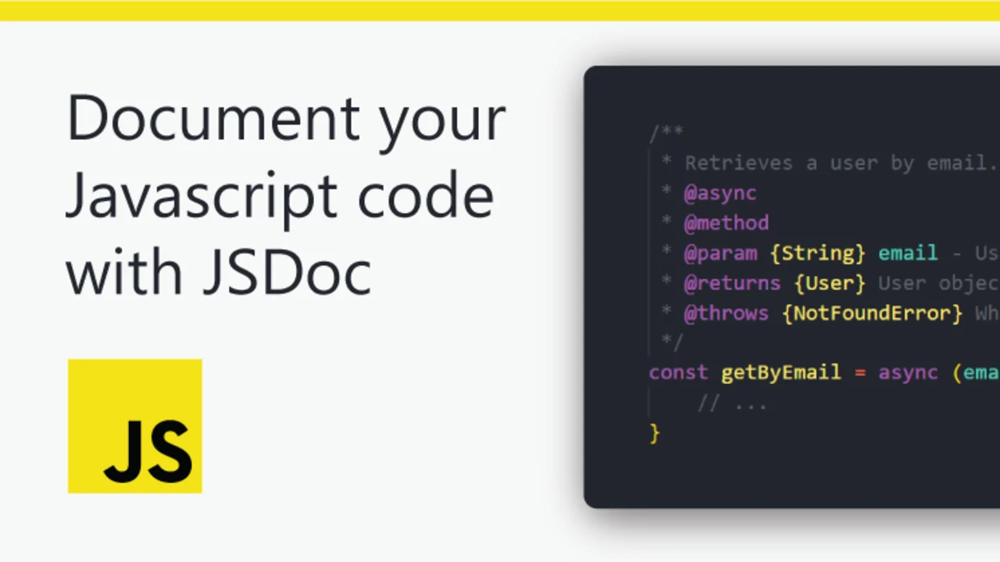

<p align="center">
 
</p>

## `JSDoc Documentation`

## `Welcome`

Hello Everyone, I'm **`Sajib Bhattacharjee, A passionate Full-Stack Web-Developer`**, I want to welcome you to `JSDoc Documentation ` - basics guideline for all.

## `Introduction`

```js
 Including documentation in codebase has its own wide range of benefits, some
 of those include ease of understanding of code to new programmers and also
 to senior programmers who want to revisit their past codebase, when documenting
 the code you need to summarize it properly this eventually helps in  understanding
 the whole codebase appropriately.
```

### `JSDoc – An API documentation generator for JavaScript.`

JSDoc is a documentation generator for Javascript, it’s similar to JavaDoc or Python Docstrings. You need to include documentation comments in your code and then JSDoc will generate an HTML documentation website with help of those comments.

#### `Steps for installing JSDoc`

To install JSDoc globally, run the following command -

```js
npm install -g jsdoc
```

If you need to install JSDoc as a dev-dependency in your project then run this command instead -

```js
npm install -D jsdoc
```

### `Configuring JSDoc`

In the “scripts” property of package.json, we will need to add the jsdoc command to run JSDoc and generate documentation, Add the command similar to given below in the package.json file.

```js
"scripts": {
    "jsdoc": "jsdoc -c jsdoc.json"
    ...
  }
```

This command has a -c tag which denotes that jsdoc will run with a custom config file, Hence let’s create a config file for JSDoc.

In the root of your project directory create a file named “jsdoc.json” , add the following code in that file:

```js
{
"plugins": ["plugins/markdown"],
"recurseDepth": 10,
"source": {
	"include": ["src"],
	"includePattern": ".js$",
	"excludePattern": "(node_modules/|docs)"
},
"templates": {
	"cleverLinks": true,
	"monospaceLinks": true
},
"opts": {
	"destination": "./jsdoc",
	"recurse": true,
	"readme": "./readme.md"
}
}
```

### `Explanation:`

- Markdown plugin is enabled which converts markdown formatted text to HTML

- recurseDepth value is set to 10, which indicates that how many levels deep the jsdoc will search for files
- To specify inputs, we have included “src” in the include property, this means that jsdoc will generate documentation for files inside the src directory
- Include patterns donates which file to select, here .js$ indicates that it will include .js, .jsx & .jsdoc files
- Node_modules and docs folder is excluded
- The templates determine the appearance of the generated documentation
- The opts section include JSDoc commands

### `Running JSDoc`

Let’s create a file index.js in the src folder and declare a variable in it to generate documentation.

```js
/**
 * Site Name
 * @type {string}
 */
const siteName = "GeeksForGeeks";
```

Here we have created a string named “siteName”, In the comments, we have a simple description of the variable and @type tag which denotes the type of variable
In VSCode after writing /\*\* the IntelliSense will automatically suggest a JSDoc comment, hit enter, and write the comment as shown below.

  

Now that our code is ready with documentation let’s run jsdoc and create a documentation

_`Step to run:`_ To run jsdoc open the terminal and write the following command-

```js
npm run jsdoc
```

This command will create a “jsdoc” folder at the root of your project directory and inside it, there will be an index.html file generated, you can open it in a browser to see our generated documentation.

### `Output:`

  

# JSDoc Resources

> **Reference**: https://www.geeksforgeeks.org/introduction-to-jsdoc/

> **Reference**:https://jsdoc.app/index.html

### `Collected By` - _`Sajib Bhattacharjee`_

---

<div 
align="center">

##### `All rights reserved by Sajib Bhattacharjee @2023`

### `Created By-->`

**&copy;`-Sajib Bhattacharjee`**

**`Dedicated for 💕"Zahan" 💕`**

> > > > ### Thanks A Lot For Visiting...!!!

</div>
